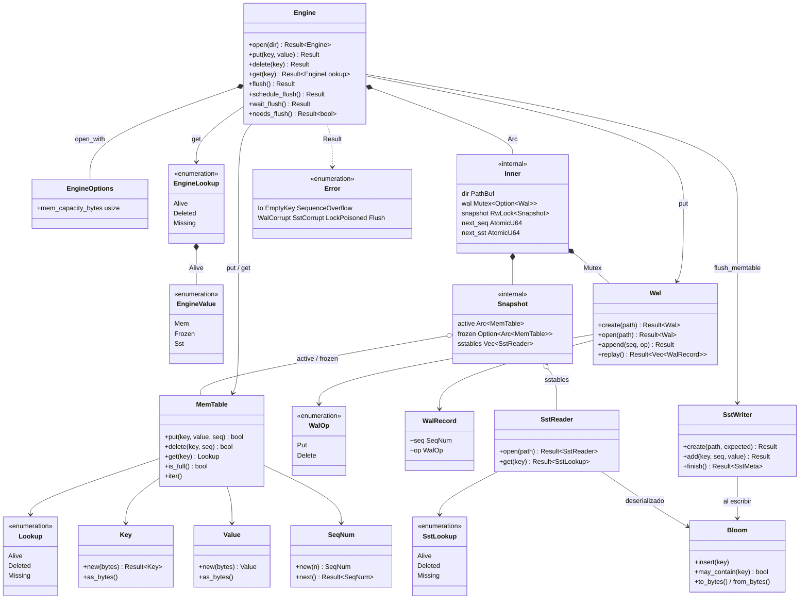

# Diagrama de clases

Modelo de los **tipos públicos** (y algunos internos relevantes). En Rust no hay clases: `struct` / `enum` + `impl`. El diagrama usa notación UML por costumbre.



## Capas (sin UML)

```text
types (Key, Value, SeqNum, Error)
        ↑
memtable / wal / index::Bloom / sstable
        ↑
     engine
```

## Notas

- `Engine` es la fachada; el estado compartido vive en `Inner` + `Snapshot`.
- `Lookup` / `SstLookup` / `EngineLookup` hablan el mismo idioma: vivo / tombstone / ausente.
- El reader de SST guarda un `mmap`; el `get` del engine **copia** a `Value` para no atar lifetimes al `RwLock`.

Ver también: [flujograma](flujograma.md) · [diagrama de flujo](diagrama-de-flujo.md)
