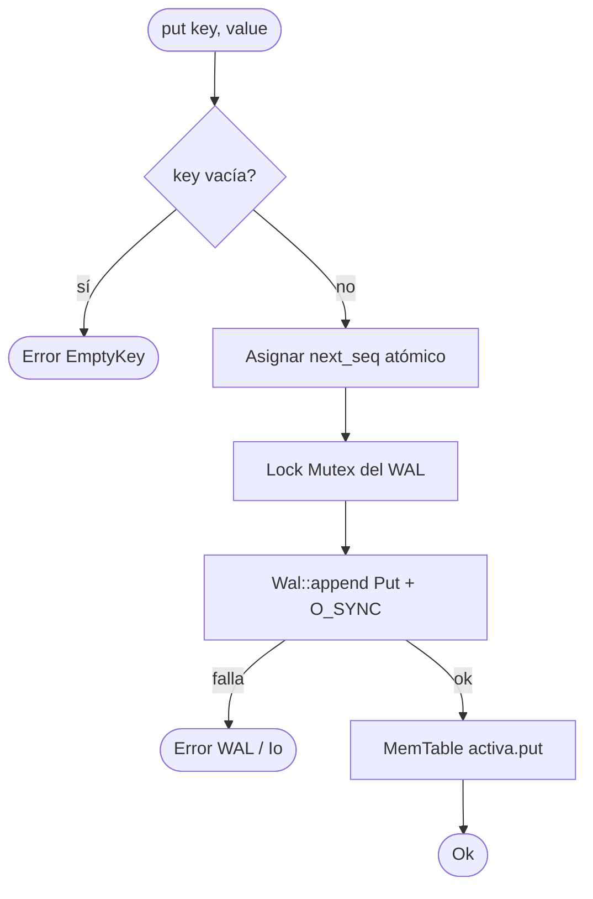
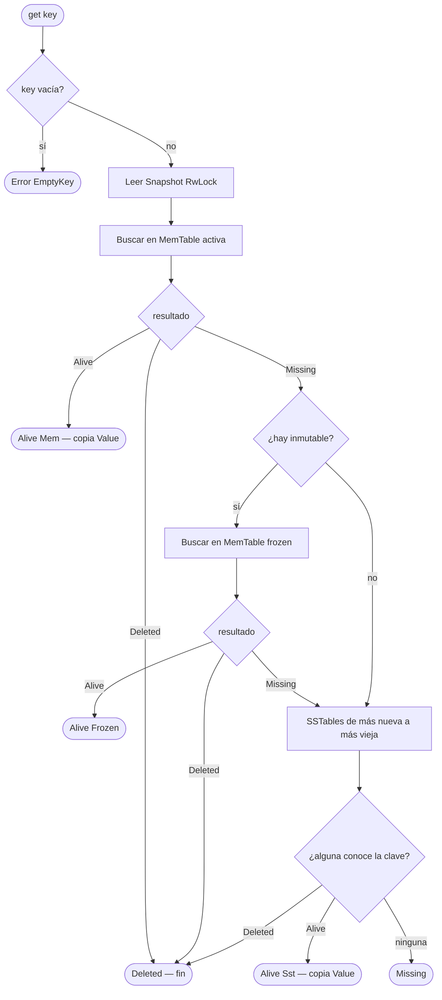
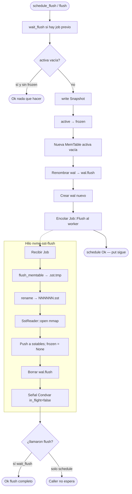
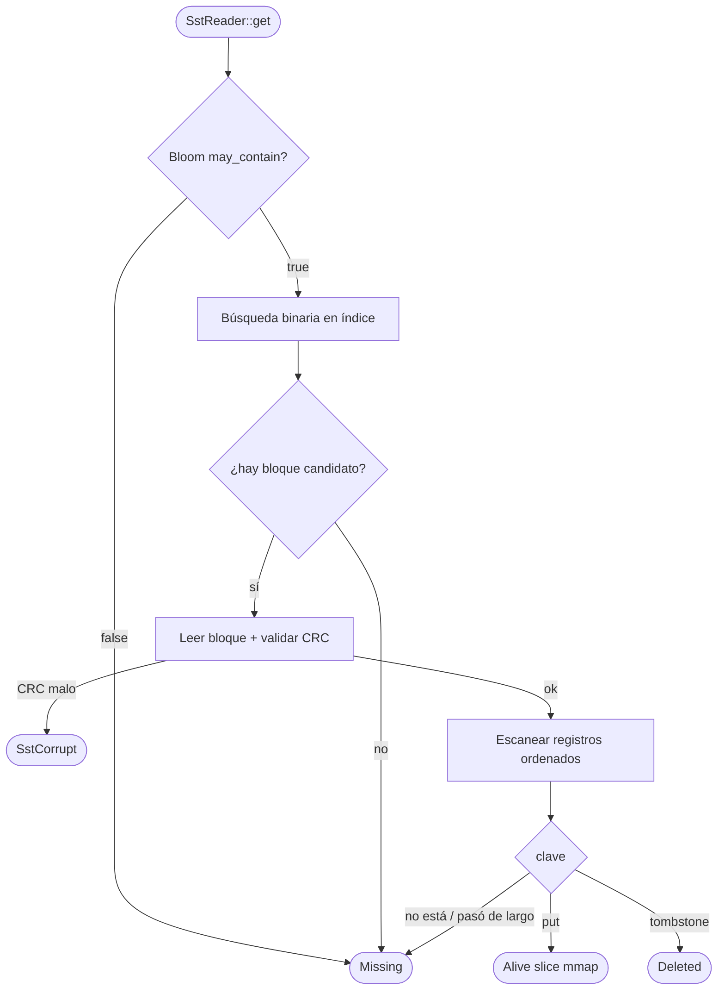
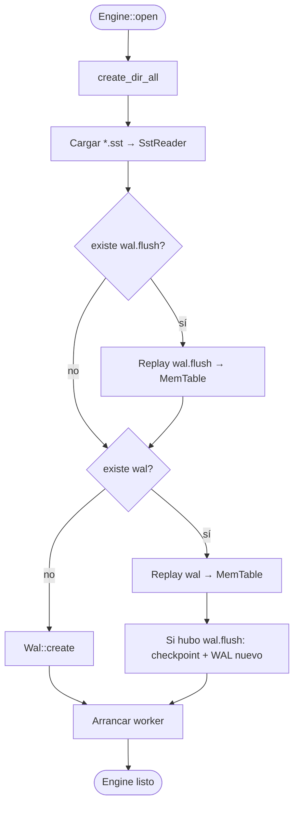

# Diagrama de flujo

Flujos **paso a paso** con decisiones. Complementa el [flujograma](flujograma.md) (arquitectura) y el [diagrama de clases](diagrama-de-clases.md).

---

## 1. `put` (escritura durable)

Orden fijo: **primero disco (WAL), después RAM**. Si el proceso muere entre F y G, el replay reconstruye la MemTable.

---

## 2. `get` (lectura)

Un **Deleted** corta la búsqueda: no se mira disco más viejo (si no, “resucitaría” un put antiguo).

---

## 3. Flush en background

`flush()` = `schedule_flush` + `wait_flush` en bucle hasta vaciar activa e inmutable.

---

## 4. Lookup dentro de una SSTable

---

## 5. Apertura / recovery

Ver también: [flujograma](flujograma.md) · [diagrama de clases](diagrama-de-clases.md)
