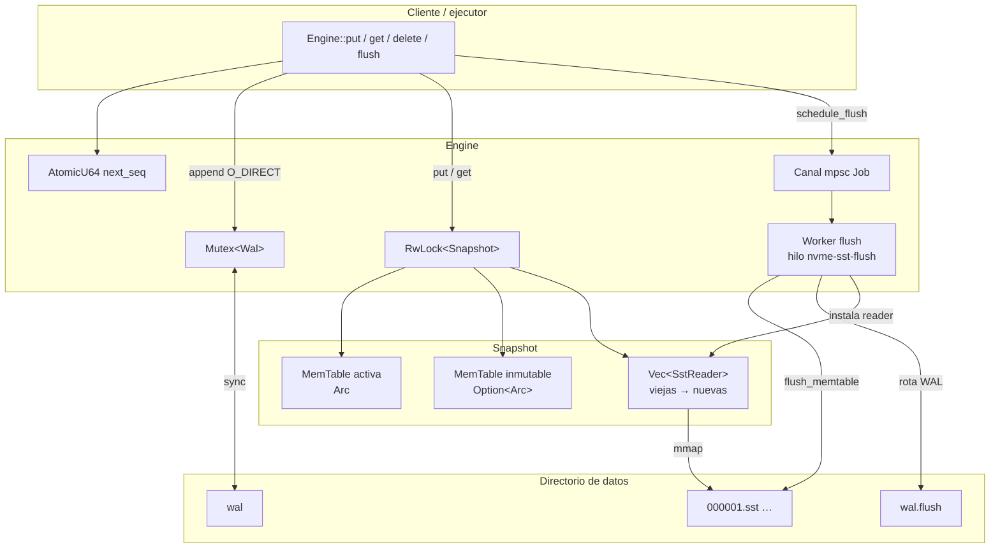

# Flujograma del sistema

Vista de **arquitectura y flujo de datos** de `nvme-state-db`: cómo se mueven las escrituras y lecturas entre piezas.

## Lectura rápida

| Dirección | Qué pasa |
|-----------|----------|
| **Write** | `put` → WAL en disco → MemTable activa |
| **Flush** | Activa se congela → worker escribe `.sst` → se suelta la inmutable |
| **Read** | Activa → inmutable (si hay) → SSTables de más nueva a más vieja |

## Relación con otros diagramas

- [Diagrama de clases](diagrama-de-clases.md) — tipos y composición
- [Diagrama de flujo](diagrama-de-flujo.md) — decisiones paso a paso (`put` / `get` / `flush`)
